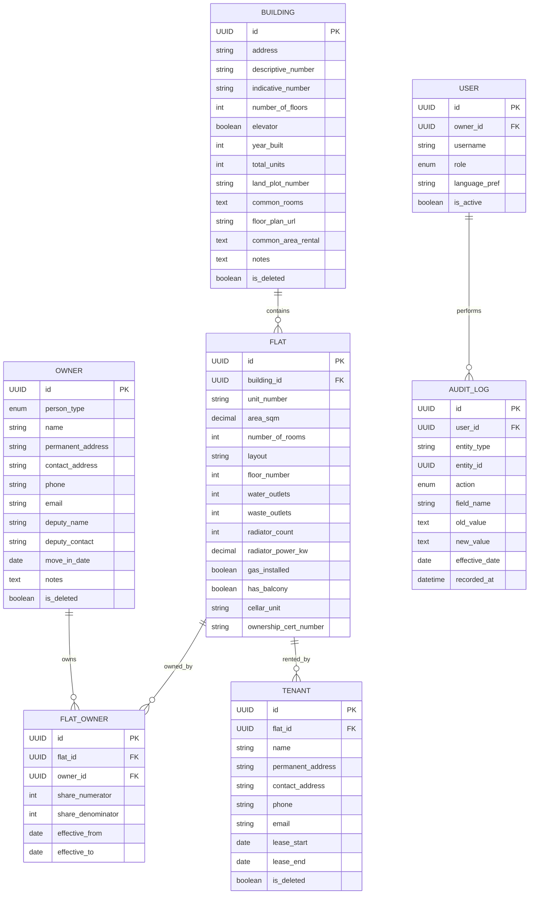

# Solomon — Facility Management System (BD Salounova)

## Software Design Document

---

## 1. Introduction

### 1.1 Purpose
A facility management system for managing residential property — a row of interconnected apartment buildings operated under a single SVJ or Housing Cooperative in the Czech Republic.

### 1.2 Scope
Building and flat registry, owner and tenant management, financial tracking, utility management, maintenance, communication, meetings, and document management. Designed as **independent modules** built incrementally.

### 1.3 MVP Scope (Phase 1)
- **Building management** — CRUD for buildings and parameters
- **Flat management** — CRUD for flats/units and parameters
- **Owner management** — CRUD for owners (natural/legal), co-ownership
- **Tenant management** — CRUD for tenants linked to flats
- **Full audit trail** — who, when, what changed, effective date

### 1.4 Future Modules (Phase 2+)
- **Financial Management** — fee collection, expense tracking per project/repair/service
- **Utility Management** — meter readings, cost calculations per flat
- **Maintenance and Repairs** — requests, status tracking, scheduling, contractors
- **Communication** — internal announcements, notifications
- **Meetings and Voting** — planning, minutes, resolutions, quorum
- **Document Management** — contracts, certificates, house rules

### 1.5 Definitions and Acronyms

| Term | Definition |
|------|-----------|
| **Flat (Jednotka)** | Apartment unit. Parameters: area, rooms, layout, floor, water/waste outlets, radiators/power, gas, balcony, cellar, ownership certificate number. |
| **Building (Budova)** | Structure with flats. Parameters: address, descriptive/indicative number, floor plan, common rooms, floors, elevator, year built, total units, land plot, common area rental. |
| **Owner (Vlastník)** | Natural or legal person owning flat (SVJ) or cooperative share. One owner can own multiple flats. One flat can have multiple owners. |
| **Tenant (Nájemník)** | Person renting a flat. One flat can have multiple tenants. |
| **SVJ** | Association of Unit Owners (Společenství vlastníků jednotek). Primary legal model. |
| **Housing Cooperative** | Alternative model. Members have cooperative share, not direct ownership. |
| **Administrator (Správce)** | Single property manager. Full read/write access. |
| **Board Member (Člen výboru)** | SVJ board member (5 total). Full read/write. Approves expenses/repairs. |
| **Chairman (Předseda)** | Head of board. Board permissions + contract approval above threshold. |
| **Individual Owner** | Read-only on own data. Can submit requests, cannot edit. |
| **Audit Trail** | Immutable log: timestamp, user, field, old/new value, effective date. |
| **Effective Date (Platnost od)** | Real-world date a change applies vs. when recorded. |

---

## 2. System Overview

### 2.1 System Description
Solomon is a **web-based application** for managing 5 interconnected apartment buildings under a single SVJ in the Czech Republic.

### 2.2 User Personas
- **Administrator** — Single property manager. Full CRUD on all data.
- **Chairman** — Head of 5-member board. Full access + special approvals.
- **Board Member** — Full read/write. Approves expenses and repairs.
- **Individual Owner** — Read-only on own data. Submits requests.

### 2.3 Key Characteristics
- Multi-building: 5 buildings under one SVJ
- Single management: one administrator, one board (5 + chairman)
- Multi-language: Czech primary, localization-ready
- Full audit trail with effective dates
- Role-based access: 4 distinct roles
- Modular: independent modules built incrementally
- Czech legal context: SVJ primary, cooperative alternative

---

## 3. Architectural Design

### 3.1 Foundation Layer

| Component | Responsibility |
|-----------|---------------|
| Auth and Identity | Login, sessions, role assignment |
| Authorization Engine | Permission checks by role and data ownership |
| Audit Trail Engine | Records all changes with user, timestamp, field diff, effective date |
| Localization Service | Czech translations, date/currency formatting |
| Notification Engine | In-app + email notifications |

### 3.2 MVP Modules

**Building Management** — CRUD for buildings. Soft delete. All changes audited.

**Flat Management** — CRUD for flats. Each flat belongs to one building. Multiple owners/tenants.

**Owner Management** — CRUD for owners (natural/legal). M:N with flats via shares. Effective dates required.

**Tenant Management** — CRUD for tenants linked to flats. Multiple per flat. Soft delete on move-out.

**Audit Trail** — Immutable log. System timestamp + effective date. Transactional with operations.

### 3.3 Future Modules (Conceptual)

**Financial Management** — Simplified income/expense tracking. Chairman approval for large expenses.

**Utility Management** — Meter readings, cost per flat by parameters. Annual settlement.

**Maintenance and Repairs** — Request lifecycle (Submitted, Approved, In Progress, Completed). Recurring scheduling.

**Communication** — Internal announcements. External website at bdsalounova.cz exists separately.

**Meetings and Voting** — Minutes, resolutions, votes weighted by ownership share, quorum.

**Document Management** — Versioned documents with role-based access.

---

## 4. Detailed Design

### 4.1 Building Management
- **Inputs:** Building data (address, parameters), user identity
- **Outputs:** Building records filtered by role, change history
- **Validation:** Required: address, descriptive number. Cannot delete building with active flats.
- **Rules:** Soft delete only. All changes produce audit entries.

### 4.2 Flat Management
- **Inputs:** Flat data (area, rooms, layout, etc.), building reference
- **Outputs:** Flat records per building, owners/tenants per flat, history
- **Validation:** Area > 0. Floor <= building floors.
- **Rules:** Belongs to one building. Co-ownership via M:N. Soft delete.

### 4.3 Owner Management
- **Inputs:** Owner data (name, type, contacts, deputy, share), flat references, effective dates
- **Outputs:** Owner records, owned flats, ownership history
- **Validation:** Shares should sum to 100% per flat (warning). Required contacts.
- **Rules:** Natural or legal person. Deputy supported. Effective date required.

### 4.4 Tenant Management
- **Inputs:** Tenant data (name, contacts), flat reference, lease dates
- **Outputs:** Tenant records per flat, lease history
- **Validation:** Lease start < end. Warn on overlapping tenancies.
- **Rules:** Multiple per flat. Linked to flat not owner. Move-out = soft delete.

### 4.5 Audit Trail
- **Inputs:** Automatic on every create/update/delete
- **Outputs:** Chronological log per entity/user/global. Filterable, exportable.
- **Rules:** Immutable. System timestamp + effective date. Transactional.

---

## 5. Database Design

### 5.1 ER Diagram



### 5.2 Key Relationships

| Relationship | Type | Description |
|-------------|------|-------------|
| Building to Flat | 1:N | Building contains many flats |
| Flat to Owner | M:N | Via FLAT_OWNER with share and effective dates |
| Flat to Tenant | 1:N | Multiple tenants per flat |
| User to Owner | 1:1 optional | Owner may have user account |
| User to Audit Log | 1:N | Every action logged |

### 5.3 Design Principles
- Soft deletes everywhere (is_deleted flag)
- Temporal data (effective_from / effective_to)
- Immutable audit log (append-only)
- UUID primary keys

---

## 6. Technology Stack

### 6.1 Decision: Django + HTMX + PostgreSQL

For a small-scale web app (~200 users, CRUD-heavy, audit trail, roles, Czech localization):

**Backend: Django (Python)**
- Built-in admin panel: instant CRUD interface for all models
- Built-in auth and permissions: roles, groups out of the box
- Built-in i18n/l10n: Czech localization and translation framework
- ORM with migrations: schema as code
- django-auditlog: audit trail with minimal code
- Mature, battle-tested, single developer can build MVP quickly

**Why not React.js?**
- Solomon is CRUD forms and tables, not a complex interactive SPA
- React + Django API = two apps, doubles development effort
- For ~200 users viewing property data, a full SPA is overengineered
- HTMX adds interactivity incrementally when needed

**Frontend: Django Templates + HTMX**
- Server-rendered HTML, fast to develop
- HTMX for dynamic behavior (inline edit, search, partial updates)
- Tailwind CSS or Bootstrap for responsive design
- 90% of React UX with 10% of the complexity

**Database: PostgreSQL**
- Best open-source relational DB for structured data with relationships
- Full-text search for Czech language
- Supported everywhere

**How Django maps to requirements:**

| Requirement | Django Solution |
|-------------|----------------|
| CRUD for all entities | ORM + Admin + ModelForms |
| Role-based access (4 roles) | auth groups + permissions |
| Full audit trail | django-auditlog |
| Czech localization | i18n (built-in Czech) |
| Soft deletes | django-safedelete |
| Responsive web UI | Templates + Bootstrap/Tailwind |

### 6.2 Hosting Analysis

| Option | Cost | Pros | Cons |
|--------|------|------|------|
| **Fly.io** (recommended for MVP) | Free to $5/mo | Free tier, easy deploy, EU regions | Free tier may change |
| **Railway / Render** | Free to $5/mo | Git push = deploy | Spins down on inactivity |
| **Google Cloud Run** | Free to $7/mo | 2M req/mo free, EU region | More DevOps needed |
| **Czech VPS** (Wedos, Forpsi) | ~100-200 CZK/mo | Czech-based, GDPR, stable | Manual setup |

**Recommendation:**

| Phase | Hosting | Cost |
|-------|---------|------|
| Development | Local Docker | Free |
| MVP/Testing | Fly.io or Railway | Free to $5/mo |
| Production | Czech VPS or Cloud Run | ~100-200 CZK/mo |

### 6.3 Project Structure

```
solomon/
  manage.py
  solomon/              # Project settings
    settings.py
    urls.py
    wsgi.py
  core/                 # Shared: audit, auth, base models
    models.py           # AuditLog, SoftDeleteModel
    middleware.py        # Current user for audit
    permissions.py      # Role-based permissions
  buildings/            # Building module
    models.py
    views.py
    forms.py
    templates/
  flats/                # Flat module
  owners/               # Owner module
  tenants/              # Tenant module
  templates/            # Shared templates
  locale/cs/            # Czech translations
  static/               # CSS, JS
  Dockerfile
  docker-compose.yml
  requirements.txt
```

---

## 7. Security

### 7.1 Authentication
- Django built-in auth (username/password, sessions)
- Password reset via email
- Optional 2FA for board members

### 7.2 Role-Permission Matrix

| Action | Admin | Chairman | Board | Owner |
|--------|:---:|:---:|:---:|:---:|
| View all buildings/flats | Y | Y | Y | own only |
| Edit buildings/flats | Y | Y | Y | N |
| View all owners/tenants | Y | Y | Y | own only |
| Edit owners/tenants | Y | Y | Y | request only |
| Submit repair request | Y | Y | Y | Y |
| Approve repair request | Y | Y | Y | N |
| Approve contracts above threshold | N | Y | N | N |
| View full audit trail | Y | Y | Y | own only |
| Manage users/roles | Y | Y | N | N |

### 7.3 Data Protection
- GDPR compliance (Czech/EU residents)
- HTTPS, encrypted at rest
- Soft delete with anonymization after retention period

---

## 8. Performance
- ~200 users, ~20 concurrent at peak
- Small data volume (thousands of records)
- Standard Django caching and DB indexing sufficient

---

## 9. Deployment
- **Dev:** Local Docker
- **Staging:** Fly.io or Railway
- **Production:** Czech VPS or Google Cloud Run
- **CI/CD:** GitHub Actions
- **Repo:** github.com/ondyn/Solomon

---

## 10. Testing
- Unit tests: business logic (shares, permissions, audit)
- Integration tests: module interactions
- E2E tests: critical user flows
- Localization tests: Czech completeness

---

## 11. Appendices

### 11.1 Resources
- Website: https://www.bdsalounova.cz/
- Repo: https://github.com/ondyn/Solomon
- Czech Civil Code, SVJ: sections 1158-1222

### 11.2 Change History

| Version | Date | Author | Changes |
|---------|------|--------|---------|
| 0.1 | 2026-03-03 | - | Initial draft |
| 0.2 | 2026-03-03 | - | System description, architecture, ER diagram, permissions |
| 0.3 | 2026-03-03 | - | Technology: Django + HTMX + PostgreSQL. Hosting analysis. |
