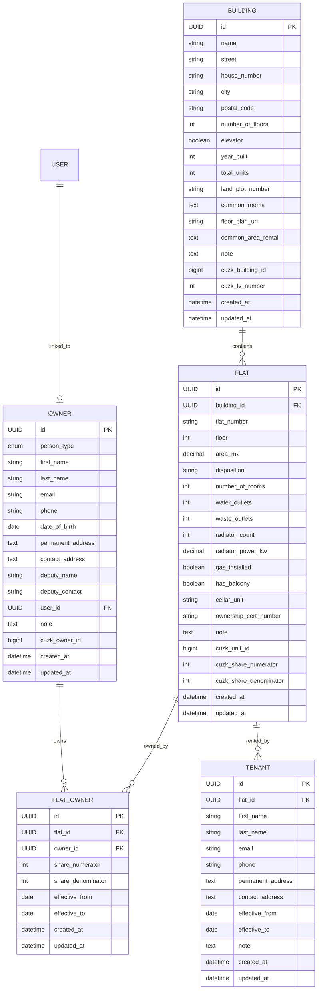

# Solomon — Facility Management System (BD Salounova)

## Software Design Document

---

## 1. Introduction

### 1.1 Purpose
A facility management system for managing residential property — a row of interconnected apartment buildings operated under a single SVJ or Housing Cooperative in the Czech Republic.

### 1.2 Scope
Building and flat registry, owner and tenant management, financial tracking, utility management, maintenance, communication, meetings, and document management. Designed as **independent modules** built incrementally.

### 1.3 MVP Scope (Phase 1)
- **Building management** — CRUD for buildings and parameters
- **Flat management** — CRUD for flats/units and parameters
- **Owner management** — CRUD for owners (natural/legal), co-ownership
- **Tenant management** — CRUD for tenants linked to flats
- **Full audit trail** — who, when, what changed, effective date

### 1.4 Future Modules (Phase 2+)
- **Financial Management** — fee collection, expense tracking per project/repair/service
- **Utility Management** — meter readings, cost calculations per flat
- **Maintenance and Repairs** — requests, status tracking, scheduling, contractors
- **Communication** — internal announcements, notifications
- **Meetings and Voting** — planning, minutes, resolutions, quorum
- **Document Management** — contracts, certificates, house rules

### 1.5 Definitions and Acronyms

| Term | Definition |
|------|-----------|
| **Flat (Jednotka)** | Apartment unit. Parameters: flat_number, floor, area_m2, disposition, number_of_rooms, water/waste outlets, radiators/power, gas, balcony, cellar, ownership certificate number, CUZK unit ID, CUZK share. |
| **Building (Budova)** | Structure with flats. Parameters: name, street, house_number, city, postal_code, number_of_floors, elevator, year_built, total_units, land_plot_number, common_rooms, floor_plan_url, common_area_rental, note, CUZK building ID, CUZK LV number. |
| **Owner (Vlastník)** | Natural or legal person owning flat (SVJ) or cooperative share. Fields: first_name, last_name, person_type, email, phone, date_of_birth, addresses, deputy info, optional User link, CUZK owner ID. One owner can own multiple flats. One flat can have multiple owners. |
| **Tenant (Nájemník)** | Person renting a flat. One flat can have multiple tenants. |
| **SVJ** | Association of Unit Owners (Společenství vlastníků jednotek). Primary legal model. |
| **Housing Cooperative** | Alternative model. Members have cooperative share, not direct ownership. |
| **Administrator (Správce)** | Single property manager. Full read/write access. |
| **Board Member (Člen výboru)** | SVJ board member (5 total). Full read/write. Approves expenses/repairs. |
| **Chairman (Předseda)** | Head of board. Board permissions + contract approval above threshold. |
| **Individual Owner** | Read-only on own data. Can submit requests, cannot edit. |
| **Audit Trail** | Immutable log: timestamp, user, field, old/new value. Provided by django-auditlog. |
| **Effective Date (Platnost od)** | Real-world date a change applies vs. when recorded. Used on FlatOwner and Tenant (effective_from / effective_to). |

---

## 2. System Overview

### 2.1 System Description
Solomon is a **web-based application** for managing 5 interconnected apartment buildings under a single SVJ in the Czech Republic.

### 2.2 User Personas
- **Administrator** — Single property manager. Full CRUD on all data.
- **Chairman** — Head of 5-member board. Full access + special approvals.
- **Board Member** — Full read/write. Approves expenses and repairs.
- **Individual Owner** — Read-only on own data. Submits requests.

### 2.3 Key Characteristics
- Multi-building: 5 buildings under one SVJ
- Single management: one administrator, one board (5 + chairman)
- Multi-language: Czech primary, localization-ready
- Full audit trail with effective dates
- Role-based access: 4 distinct roles
- Modular: independent modules built incrementally
- Czech legal context: SVJ primary, cooperative alternative

---

## 3. Architectural Design

### 3.1 Foundation Layer

| Component | Responsibility | Status |
|-----------|---------------|--------|
| Auth and Identity | Login, sessions, role assignment, password change | ✅ Implemented (Django auth + accounts app) |
| Authorization Engine | Permission checks by role and data ownership | ✅ Implemented (groups, `RoleFilteredQuerysetMixin`) |
| Audit Trail Engine | Records all changes with user, timestamp, field diff | ✅ Implemented (django-auditlog + browsing views) |
| Localization Service | Czech translations, date/currency formatting | ✅ Implemented (Django i18n, Czech primary) |
| CUZK Integration | Import buildings, flats, and owners from Czech Cadastral Office API | ✅ Implemented (core/cuzk_service.py, core/cuzk_import.py) |
| Notification Engine | In-app + email notifications | 🔮 Future |

### 3.2 MVP Modules

**Building Management** — CRUD for buildings. Soft delete. All changes audited. CUZK integration for importing building data from the Czech cadastral register.

**Flat Management** — CRUD for flats. Each flat belongs to one building. Multiple owners/tenants. CUZK integration for importing unit data and common-area shares.

**Owner Management** — CRUD for owners (natural/legal). M:N with flats via shares. Effective dates required. CUZK integration for importing owner data.

**Tenant Management** — CRUD for tenants linked to flats. Multiple per flat. Soft delete on move-out.

**Audit Trail** — Immutable log. System timestamp. Browsable via global and per-entity views with filtering. Transactional with operations.

**User Management** — CRUD for user accounts (accounts app). Admin/Chairman can create, edit, and manage users and their role (group) assignments.

### 3.3 Future Modules (Conceptual)

**Financial Management** — Simplified income/expense tracking. Chairman approval for large expenses.

**Utility Management** — Meter readings, cost per flat by parameters. Annual settlement.

**Maintenance and Repairs** — Request lifecycle (Submitted, Approved, In Progress, Completed). Recurring scheduling.

**Communication** — Internal announcements. External website at bdsalounova.cz exists separately.

**Meetings and Voting** — Minutes, resolutions, votes weighted by ownership share, quorum.

**Document Management** — Versioned documents with role-based access.

---

## 4. Detailed Design

### 4.1 Building Management
- **Inputs:** Building data (name, street, house_number, city, postal_code, floors, elevator, year_built, total_units, land_plot, common_rooms, floor_plan_url, common_area_rental, note), user identity
- **Outputs:** Building records filtered by role, change history
- **Validation:** Required: name, street, house_number, postal_code. Cannot delete building with active flats (on_delete=PROTECT on Flat FK).
- **Rules:** Soft delete only. All changes produce audit entries. CUZK fields (cuzk_building_id, cuzk_lv_number) for cadastral linking.

### 4.2 Flat Management
- **Inputs:** Flat data (flat_number, floor, area_m2, disposition, number_of_rooms, water/waste outlets, radiators, gas, balcony, cellar, ownership_cert_number, note), building reference
- **Outputs:** Flat records per building, owners/tenants per flat, history
- **Validation:** Building reference required. Flat number unique within building.
- **Rules:** Belongs to one building (FK with PROTECT). Co-ownership via M:N FlatOwner. Soft delete. CUZK fields (cuzk_unit_id, cuzk_share_numerator/denominator) for cadastral linking.

### 4.3 Owner Management
- **Inputs:** Owner data (first_name, last_name, person_type, email, phone, date_of_birth, permanent_address, contact_address, deputy_name, deputy_contact, note), flat references, share (numerator/denominator), effective dates
- **Outputs:** Owner records, owned flats, ownership history
- **Validation:** Shares should sum to 100% per flat (warning). First and last name required. Share numerator/denominator >= 1.
- **Rules:** Natural or legal person. Deputy supported. Effective date required on FlatOwner. Optional link to Django User. CUZK field (cuzk_owner_id) for cadastral linking. FlatOwner unique constraint on (flat, owner, effective_from).

### 4.4 Tenant Management
- **Inputs:** Tenant data (first_name, last_name, email, phone, permanent_address, contact_address, note), flat reference, effective_from / effective_to dates
- **Outputs:** Tenant records per flat, lease history
- **Validation:** effective_from required. Warn on overlapping tenancies.
- **Rules:** Multiple per flat. Linked to flat not owner (FK with PROTECT). Move-out = soft delete or setting effective_to.

### 4.5 Audit Trail
- **Inputs:** Automatic on every create/update/delete via django-auditlog middleware + `@register_auditlog` decorator
- **Outputs:** Chronological log per entity/user/global. Filterable by actor, action, content type, object ID. Paginated (50 per page).
- **Rules:** Immutable. System timestamp recorded by auditlog. Transactional. Browsable via AuditLogListView and AuditLogDetailView.

---

## 5. Database Design

### 5.1 ER Diagram


```mermaid
erDiagram
    BUILDING ||--o{ FLAT : contains
    FLAT ||--o{ FLAT_OWNER : owned_by
    OWNER ||--o{ FLAT_OWNER : owns
    FLAT ||--o{ TENANT : rented_by
    USER ||--o| OWNER : linked_to

    BUILDING {
        UUID id PK
        string name
        string street
        string house_number
        string city
        string postal_code
        int number_of_floors
        boolean elevator
        int year_built
        int total_units
        string land_plot_number
        text common_rooms
        string floor_plan_url
        text common_area_rental
        text note
        bigint cuzk_building_id
        int cuzk_lv_number
        datetime created_at
        datetime updated_at
    }

    FLAT {
        UUID id PK
        UUID building_id FK
        string flat_number
        int floor
        decimal area_m2
        string disposition
        int number_of_rooms
        int water_outlets
        int waste_outlets
        int radiator_count
        decimal radiator_power_kw
        boolean gas_installed
        boolean has_balcony
        string cellar_unit
        string ownership_cert_number
        text note
        bigint cuzk_unit_id
        int cuzk_share_numerator
        int cuzk_share_denominator
        datetime created_at
        datetime updated_at
    }

    OWNER {
        UUID id PK
        enum person_type
        string first_name
        string last_name
        string email
        string phone
        date date_of_birth
        text permanent_address
        text contact_address
        string deputy_name
        string deputy_contact
        UUID user_id FK
        text note
        bigint cuzk_owner_id
        datetime created_at
        datetime updated_at
    }

    FLAT_OWNER {
        UUID id PK
        UUID flat_id FK
        UUID owner_id FK
        int share_numerator
        int share_denominator
        date effective_from
        date effective_to
        datetime created_at
        datetime updated_at
    }

    TENANT {
        UUID id PK
        UUID flat_id FK
        string first_name
        string last_name
        string email
        string phone
        text permanent_address
        text contact_address
        date effective_from
        date effective_to
        text note
        datetime created_at
        datetime updated_at
    }
```

### 5.2 Key Relationships

| Relationship | Type | Description |
|-------------|------|-------------|
| Building to Flat | 1:N | Building contains many flats |
| Flat to Owner | M:N | Via FLAT_OWNER with share and effective dates |
| Flat to Tenant | 1:N | Multiple tenants per flat |
| User to Owner | 1:1 optional | Owner may have user account |

### 5.3 Design Principles
- Soft deletes everywhere (django-safedelete with `SOFT_DELETE_CASCADE` policy; `deleted` field managed automatically)
- Temporal data (effective_from / effective_to) on FlatOwner and Tenant
- Immutable audit log (append-only, via django-auditlog)
- UUID primary keys on all domain models
- `created_at` / `updated_at` timestamps on all models via `BaseModel`
- CUZK integration fields on Building, Flat, and Owner for cadastral data linking

---

## 6. Technology Stack

### 6.1 Decision: Django + HTMX + PostgreSQL

For a small-scale web app (~200 users, CRUD-heavy, audit trail, roles, Czech localization):

**Backend: Django (Python)**
- Built-in admin panel: instant CRUD interface for all models
- Built-in auth and permissions: roles, groups out of the box
- Built-in i18n/l10n: Czech localization and translation framework
- ORM with migrations: schema as code
- django-auditlog: audit trail with minimal code
- Mature, battle-tested, single developer can build MVP quickly

**Why not React.js?**
- Solomon is CRUD forms and tables, not a complex interactive SPA
- React + Django API = two apps, doubles development effort
- For ~200 users viewing property data, a full SPA is overengineered
- HTMX adds interactivity incrementally when needed

**Frontend: Django Templates + HTMX + Bootstrap 5**
- Server-rendered HTML, fast to develop
- HTMX for dynamic behavior (inline edit, search, partial updates)
- Bootstrap 5 for responsive design
- 90% of React UX with 10% of the complexity

**Database: PostgreSQL**
- Best open-source relational DB for structured data with relationships
- Full-text search for Czech language
- Supported everywhere

**How Django maps to requirements:**

| Requirement | Django Solution |
|-------------|----------------|
| CRUD for all entities | ORM + Admin + ModelForms + CBVs |
| Role-based access (4 roles) | auth groups + permissions + RoleFilteredQuerysetMixin |
| Full audit trail | django-auditlog + browsing views |
| Czech localization | i18n (built-in Czech) |
| Soft deletes | django-safedelete (SOFT_DELETE_CASCADE) |
| Responsive web UI | Templates + Bootstrap 5 |
| Static files | whitenoise (compressed, manifest) |
| Package management | uv (fast Python package manager) |
| CUZK integration | requests + custom service layer |

### 6.2 Hosting Analysis

| Option | Cost | Pros | Cons |
|--------|------|------|------|
| **Fly.io** (recommended for MVP) | Free to $5/mo | Free tier, easy deploy, EU regions | Free tier may change |
| **Railway / Render** | Free to $5/mo | Git push = deploy | Spins down on inactivity |
| **Google Cloud Run** | Free to $7/mo | 2M req/mo free, EU region | More DevOps needed |
| **Czech VPS** (Wedos, Forpsi) | ~100-200 CZK/mo | Czech-based, GDPR, stable | Manual setup |

**Recommendation:**

| Phase | Hosting | Cost |
|-------|---------|------|
| Development | Local Docker | Free |
| MVP/Testing | Fly.io or Railway | Free to $5/mo |
| Production | Czech VPS or Cloud Run | ~100-200 CZK/mo |

### 6.3 Project Structure

```
FM-Salounova/                # Git repository root
├── manage.py                # Django management (defaults to settings.dev)
├── pyproject.toml           # Project metadata, ALL dependencies, ruff/mypy/pytest/coverage config
├── conftest.py              # Root-level shared pytest fixtures
├── Dockerfile               # Multi-stage build (base → builder → development/production)
├── docker-compose.yml       # Local dev: PostgreSQL 16 + Django (ports 8000, 5678)
├── Makefile                 # Shortcuts for common Docker commands
├── .env.example             # Template for environment variables
├── .pre-commit-config.yaml  # Pre-commit hooks (ruff, mypy, trailing-whitespace)
├── DESIGN.md                # This design document
├── README.md                # Project readme
│
├── solomon/                 # Django project package
│   ├── settings/
│   │   ├── base.py          # Shared settings (django-environ, apps, middleware, i18n, static)
│   │   ├── dev.py           # Development (DEBUG=True, debug_toolbar, console email)
│   │   ├── prod.py          # Production (DEBUG=False, HTTPS, HSTS, SMTP email)
│   │   └── test.py          # Testing (in-memory SQLite, fast password hasher)
│   ├── urls.py              # Root URL conf with i18n_patterns
│   ├── context_processors.py # app_version context processor
│   ├── wsgi.py
│   └── asgi.py
│
├── core/                    # Shared: base models, permissions, mixins, audit views, CUZK integration
│   ├── models.py            # BaseModel (UUID pk, timestamps, SafeDeleteModel), @register_auditlog
│   ├── permissions.py       # Roles class (ADMIN, CHAIRMAN, BOARD_MEMBER, OWNER)
│   ├── mixins.py            # RoleFilteredQuerysetMixin for role-based data filtering
│   ├── views.py             # HomeView, AuditLogListView, AuditLogDetailView
│   ├── cuzk_service.py      # CUZK API client (Czech Cadastral Office)
│   ├── cuzk_import.py       # CUZK import views (search, preview, import)
│   └── urls.py              # Audit trail + CUZK import URL routes
│
├── accounts/                # User management (CRUD for auth.User, role/group assignment)
│   ├── views.py             # UserListView, UserDetailView, UserCreateView, UserUpdateView
│   ├── forms.py
│   └── urls.py
│
├── buildings/               # Building management module
│   ├── models.py, views.py, forms.py, urls.py, admin.py
│
├── flats/                   # Flat management module
│   ├── models.py, views.py, forms.py, urls.py, admin.py
│
├── owners/                  # Owner management module (includes FlatOwner junction)
│   ├── models.py, views.py, forms.py, urls.py, admin.py
│   └── import_owners.py     # Owner import from CUZK data
│
├── tenants/                 # Tenant management module
│   ├── models.py, views.py, forms.py, urls.py, admin.py
│
├── templates/               # Shared templates
│   ├── base.html            # Base layout (Bootstrap 5, HTMX, blocks: title/content/scripts)
│   ├── home.html            # Home dashboard page
│   ├── includes/            # Partials (navbar.html, etc.)
│   ├── registration/        # Login, password change templates
│   ├── accounts/            # User management templates
│   ├── buildings/           # Building templates
│   ├── flats/               # Flat templates
│   ├── owners/              # Owner templates
│   ├── tenants/             # Tenant templates
│   └── core/                # Audit log templates
│
├── static/                  # Static files (CSS, JS, images)
└── locale/cs/               # Czech translations
```

---

## 7. Security

### 7.1 Authentication
- Django built-in auth (username/password, sessions)
- Password change via built-in views (PasswordChangeView)
- Login/logout via Django's auth views
- Optional 2FA for board members (future)

### 7.2 Role-Permission Matrix

| Action | Admin | Chairman | Board | Owner |
|--------|:---:|:---:|:---:|:---:|
| View all buildings/flats | Y | Y | Y | own only |
| Edit buildings/flats | Y | Y | Y | N |
| View all owners/tenants | Y | Y | Y | own only |
| Edit owners/tenants | Y | Y | Y | request only |
| Submit repair request | Y | Y | Y | Y |
| Approve repair request | Y | Y | Y | N |
| Approve contracts above threshold | N | Y | N | N |
| View full audit trail | Y | Y | Y | own only |
| Manage users/roles | Y | Y | N | N |

### 7.3 Data Protection
- GDPR compliance (Czech/EU residents)
- HTTPS, encrypted at rest
- Soft delete with anonymization after retention period

---

## 8. Performance
- ~200 users, ~20 concurrent at peak
- Small data volume (thousands of records)
- Standard Django caching and DB indexing sufficient

---

## 9. Deployment
- **Dev:** Docker Compose (PostgreSQL 16 + NetBox on port 8000, debugpy on port 5678)
- **Staging:** Fly.io or Railway (future)
- **Production:** Czech VPS or Google Cloud Run (future)
- **CI/CD:** GitHub Actions
- **Repo:** github.com/ondyn/Solomon
- **Package Manager:** uv (fast Python package manager by Astral)

### 9.1 Plugin Development Workflow

Solomon extends NetBox via **custom plugins** developed in the `./plugins/` directory.

#### Architecture

| Component | Path | Purpose |
|-----------|------|---------|
| Local plugins | `./plugins/<name>/` | Editable Python packages, volume-mounted into container |
| Third-party plugins | `plugin-requirements.txt` | PyPI packages installed via `uv` at image build |
| Plugin config | `docker/configuration/plugins.py` | Registers plugins + plugin-specific settings |
| Dev image | `Dockerfile.plugins` | Extends official NetBox image with dev tools |
| Dev overrides | `docker-compose.override.yml` | Adds build, volumes, reload, debugpy |
| Entrypoint | `docker/plugin-entrypoint.sh` | Installs local plugins in editable mode at startup |
| Dev launcher | `docker/launch-netbox-dev.sh` | Granian with `--reload` and `WATCHFILES_FORCE_POLLING` |

#### Creating a New Local Plugin

```bash
# 1. Create plugin directory structure
mkdir -p plugins/my_plugin/my_plugin/migrations
touch plugins/my_plugin/my_plugin/migrations/__init__.py

# 2. Create pyproject.toml, __init__.py (with PluginConfig), models, views, urls, etc.
#    See plugins/solomon_test_plugin/ for a working example.

# 3. Register in docker/configuration/plugins.py:
#    PLUGINS = ["my_plugin"]

# 4. Start/restart containers (plugin is installed in editable mode automatically):
docker compose up -d

# 5. Create and apply migrations:
docker compose exec netbox python manage.py makemigrations my_plugin
docker compose exec netbox python manage.py migrate my_plugin
```

#### Installing Third-Party Plugins

```bash
# 1. Add to plugin-requirements.txt:
echo "netbox-bgp>=0.14.0" >> plugin-requirements.txt

# 2. Rebuild image:
docker compose build netbox

# 3. Register in docker/configuration/plugins.py:
#    PLUGINS = ["netbox_bgp"]

# 4. Restart:
docker compose up -d
```

#### Hot-Reload

Granian runs with `--reload` watching `./plugins/` and core NetBox code. Uses `WATCHFILES_FORCE_POLLING=true` for reliable detection on macOS Docker Desktop (virtiofs). Edit any `.py` file in `./plugins/` and the server restarts automatically within ~1 second.

#### Remote Debugging (debugpy)

1. Set `DEBUGPY_ENABLE=true` in `.env`
2. Restart: `docker compose up -d`
3. In VS Code, use launch config **"NetBox: Attach to Container (debugpy)"**
4. Set breakpoints in `./plugins/` code — they are mapped via `pathMappings`

---

## 10. Testing
- **Framework:** pytest + pytest-django (configured in `pyproject.toml`)
- **Settings:** Tests use `solomon.settings.test` (in-memory SQLite, fast password hasher)
- **Shared fixtures:** Root-level `conftest.py` provides `client`, `admin_client`, `admin_user`
- **Factories:** factory-boy for test data
- **Coverage:** pytest-cov with `fail_under = 70`
- Unit tests: business logic (shares, permissions, audit)
- Integration tests: module interactions
- Localization tests: Czech completeness
- Run tests: `docker compose exec web uv run pytest`

---

## 11. Appendices

### 11.1 Resources
- Website: https://www.bdsalounova.cz/
- Repo: https://github.com/ondyn/Solomon
- Czech Civil Code, SVJ: sections 1158-1222

### 11.2 Change History

| Version | Date | Author | Changes |
|---------|------|--------|---------|
| 0.1 | 2026-03-03 | - | Initial draft |
| 0.2 | 2026-03-03 | - | System description, architecture, ER diagram, permissions |
| 0.3 | 2026-03-03 | - | Technology: Django + HTMX + PostgreSQL. Hosting analysis. |
| 0.4 | 2026-03-31 | - | Updated to match implementation: ER diagram reflects actual model fields (name/street/house_number, first_name/last_name, disposition, CUZK fields, effective_from/to on Tenant). Added CUZK integration, accounts app, RoleFilteredQuerysetMixin. Updated project structure (settings/, pyproject.toml, conftest.py). Updated tech stack details (uv, whitenoise, Bootstrap 5). |
