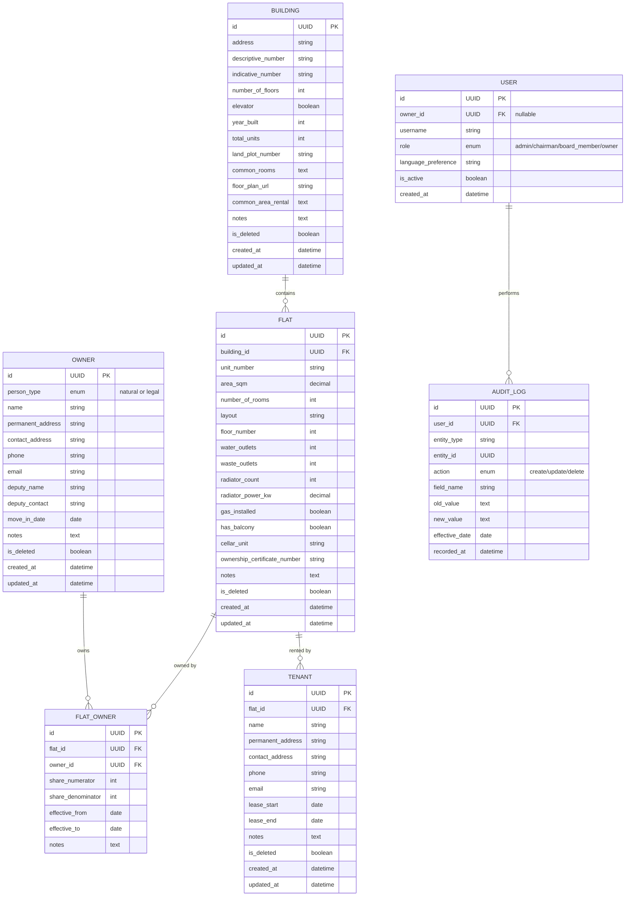

# Facility Management System — BD Salounova# Facility Management System


## Software Design Document## Software Design Document

1. ### Introduction

---- Purpose: Facility management system

- Scope: Users will be able to handle all tasks related to manage their property. Usually house of flats and all related tasks.

## 1. Introduction- Definitions and Acronyms: 

    - Flat: The building contains several apartments (flats) with different parameters (area, number of rooms, number of water and waste outlets, number of radiators and their power, whether gas is installed, etc.) 

### 1.1 Purpose    - Building: Building contains flats and has its own parameters as floor plan, common rooms (such as laundry room, drying room, bike room, workshop), address, descriptive and indicative number, 

A facility management system designed for managing residential property — specifically a row of interconnected apartment buildings (house of flats) operated under a single legal entity (SVJ or Housing Cooperative) in the Czech Republic. The system replaces existing manual processes and spreadsheets used by the property manager.    - Owner: Unit which owns the flat (Association of Unit Owners) or have the right to use the flat (housing cooperative)

    - Housing cooperative: A housing cooperative is a legal entity and a specific business corporation, established by at least 3 members primarily for the purpose of providing housing needs of its members, not for the purpose of doing business. It owns an apartment building and concludes lease agreements with its members for an indefinite period; members do not own the apartments directly, but have a cooperative share.

### 1.2 Scope    - Association of Unit Owners: Unit Owners Association. This is a legal entity established for the purpose of managing, operating and repairing common parts of a house and land. All owners of apartments and non-residential premises in a given house are mandatory members of the SVJ.

Users will be able to handle all tasks related to managing their property: building and flat registry, owner and tenant management, financial tracking, utility management, maintenance and repairs, communication, meetings, and document management. The system is designed as a set of **independent modules** that can be designed and implemented incrementally.

1. ### System Overview

### 1.3 MVP Scope (Phase 1)- System Description

The first version of the system focuses on the **core property registry**:1. ### Architectural Design

- **Building management** — CRUD operations for buildings and their parameters- System Architecture Diagram

- **Flat management** — CRUD operations for flats/units and their parameters- Component Breakdown

- **Owner management** — CRUD operations for owners (natural or legal persons), including co-ownership- Technology Stack

- **Tenant management** — CRUD operations for tenants, linked to flats and owners- Data Flow and Control Flow

- **Full audit trail** — Every change is recorded: who made it, when, what changed, and the effective date (since when it applies)

1. ### Detailed Design

### 1.4 Future Modules (Phase 2+)- [Component Name]

The following modules are defined conceptually but will be designed and implemented later:    - Responsibilities: [What does it do?]

- **Financial Management** — fee collection, expense tracking, cost per project/repair/service    - Interfaces/APIs:

- **Utility Management** — meter readings, utility cost calculations per flat    - Inputs: [Describe input data.]

- **Maintenance & Repairs** — repair requests, status tracking, scheduling, contractor management    - Outputs: [Describe output data.]

- **Communication** — internal announcements, notifications (external website exists at https://www.bdsalounova.cz/)    - Error Handling: [Describe approach.]

- **Meetings & Voting** — meeting planning, minutes, resolutions, quorum tracking    - Data Structures: [Key models/schemas.]

- **Document Management** — contracts, certificates, house rules, meeting minutes    - Algorithms/Logic: [Design patterns or important logic.]

    - State Management: [How is state handled?]

### 1.5 Definitions and Acronyms

1. ### Database Design

| Term | Definition |ER Diagram / Schema Diagram:

|------|-----------|Use Mermaid ER diagram here.

| **Flat (Jednotka)** | An apartment unit within a building. Has parameters: area, number of rooms, layout, floor number, number of water and waste outlets, number of radiators and their power, gas installation status, balcony, cellar unit, unit ownership certificate number. |Tables/Collections: [Define each with fields and constraints.]

| **Building (Budova)** | A physical structure containing flats. Has parameters: address, descriptive number (číslo popisné), indicative number (číslo orientační), floor plan, common rooms (laundry, drying room, bike room, workshop), number of floors, elevator, year built, total units, land plot number, rental of common areas. |Relationships: [Describe relationships between entities.]

| **Owner (Vlastník)** | A natural or legal person who owns a flat (in SVJ) or holds a cooperative share (in housing cooperative). One owner can own multiple flats. One flat can be owned by multiple owners (co-ownership). |Migration Strategy: [If applicable.]

| **Tenant (Nájemník)** | A person renting a flat from its owner. One flat can have multiple tenants. The system tracks their contact information. |1. ### External Interfaces

| **SVJ (Společenství vlastníků jednotek)** | Association of Unit Owners. A legal entity established for managing, operating and repairing common parts of a house and land. All owners of apartments and non-residential premises are mandatory members. This is the primary legal model for this system. |User Interface: [Mockups, UX notes.]

| **Housing Cooperative (Bytové družstvo)** | A legal entity and specific business corporation, established by at least 3 members primarily for providing housing needs. It owns the apartment building and concludes lease agreements with members; members do not own apartments directly but have a cooperative share. Supported as an alternative legal model. |External APIs: [Integrations and dependencies.]

| **Administrator (Správce)** | The property manager responsible for the day-to-day operation of all buildings. There is one administrator for the entire property. Has full read/write access to all data. |Hardware Interfaces: [If any.]

| **Board Member (Člen výboru)** | A member of the SVJ/cooperative governing board (5 members total). Has full read/write access. Can approve expenses and repair requests. |Network Protocols/Communication:

| **Chairman (Předseda)** | The head of the board. Has all board member permissions plus special approval rights: approving repair requests, contracts above a defined monetary threshold. |[REST, GraphQL, gRPC, WebSockets, etc.]

| **Individual Owner (Vlastník – uživatel)** | An owner accessing the system. Can view only their own relevant data (their flats, their financial records, their utility readings). Can submit requests (repair, data change) but cannot edit data directly. |1. ### Security Considerations

| **Audit Trail** | A complete history log of every data change: timestamp of change, who performed it, what field changed (old value → new value), and the effective date (since when the change applies in the real world). |Authentication: [Method used.]

| **Effective Date (Platnost od)** | The real-world date from which a change applies (e.g., ownership transfer date), as opposed to the timestamp when the change was recorded in the system. |Authorization: [Role/permission models.]

Data Protection: [Encryption, storage.]

---Compliance: [GDPR, HIPAA, etc.]

Threat Model:

## 2. System OverviewUse Mermaid diagram here if helpful.

1. ### Performance and Scalability

### 2.1 System DescriptionExpected Load: [Requests per second, data volume.]

The Facility Management System is a **web-based application** for managing a residential property complex consisting of 5 interconnected apartment buildings operated under a single SVJ (Společenství vlastníků jednotek) in the Czech Republic.Caching Strategy: [Describe caches used.]

Database Optimization: [Indexes, partitioning.]

The system serves as the central tool for the property administrator, board members, and individual owners to manage all aspects of the property — from the physical registry of buildings and flats, through ownership and tenancy records, to financial tracking, maintenance, and communication.Scaling Strategy: [Vertical/horizontal.]

1. ### Deployment Architecture

### 2.2 User PersonasEnvironments: [Dev, staging, production.]

CI/CD Pipeline: [Tools and stages.]

#### Persona 1: Administrator (Správce)Infrastructure Diagram:

- **Who:** The single property manager responsible for all 5 buildingsUse Mermaid diagram here.

- **Goals:** Maintain accurate records of all buildings, flats, owners, and tenants. Track finances, coordinate repairs, manage utilities.Cloud/Hosting: [AWS, GCP, Azure, etc.]

- **Access level:** Full read/write access to all data across all buildings and modulesContainerization/Orchestration: [Docker, Kubernetes.]

- **Typical tasks:** Register new owner, update flat parameters, record meter readings, generate financial reports, manage repair requests10. Testing Strategy

Unit Testing: [Tools, coverage goals.]

#### Persona 2: Chairman (Předseda)Integration Testing: [Approach and tools.]

- **Who:** Head of the 5-member SVJ boardEnd-to-End Testing: [Scope and tools.]

- **Goals:** Oversee property management, approve significant decisionsQuality Metrics: [Code coverage, linting, etc.]

- **Access level:** Full read/write access + special approval rights (repair requests, contracts above defined threshold)11. Appendices

- **Typical tasks:** Approve large expenses, review repair requests, sign off on contracts, oversee board decisionsDiagrams: [All referenced diagrams.]

Glossary: [Terms and definitions.]

#### Persona 3: Board Member (Člen výboru)Change History:

- **Who:** One of 5 members of the SVJ governing board[Version, Date, Author, Changes]
- **Goals:** Participate in property management decisions, review data
- **Access level:** Full read/write access, can approve expenses and repair requests
- **Typical tasks:** Review financial reports, approve repair requests, update property data

#### Persona 4: Individual Owner (Vlastník)
- **Who:** An owner of one or more flats
- **Goals:** View their own data, submit requests
- **Access level:** Read-only access to their own relevant data (their flats, their financial records). Can submit change requests and repair requests but cannot edit data directly.
- **Typical tasks:** View their flat details, check utility costs, submit a repair request, request a data change (e.g., new phone number — but the change must be confirmed by admin/board)

### 2.3 Modular Architecture (Conceptual)
The system is composed of independent modules. Each module can be designed, implemented, and deployed separately. All modules share a common foundation.

```
┌─────────────────────────────────────────────────────────────────────┐
│                        FACILITY MANAGEMENT SYSTEM                   │
├─────────────────────────────────────────────────────────────────────┤
│                                                                     │
│  ┌──────────────┐  ┌──────────────┐  ┌──────────────┐              │
│  │  🏗 Building  │  │  🏠 Flat     │  │  👤 Owner    │  MVP        │
│  │  Management  │  │  Management  │  │  Management  │  (Phase 1)  │
│  └──────────────┘  └──────────────┘  └──────────────┘              │
│  ┌──────────────┐  ┌──────────────┐                                │
│  │  🧑 Tenant   │  │  📋 Audit    │                  MVP          │
│  │  Management  │  │  Trail       │                  (Phase 1)    │
│  └──────────────┘  └──────────────┘                                │
│                                                                     │
│  ┌──────────────┐  ┌──────────────┐  ┌──────────────┐              │
│  │  💰 Financial│  │  🔧 Utility  │  │  🛠 Mainten. │  Future     │
│  │  Management  │  │  Management  │  │  & Repairs   │  (Phase 2+) │
│  └──────────────┘  └──────────────┘  └──────────────┘              │
│  ┌──────────────┐  ┌──────────────┐  ┌──────────────┐              │
│  │  📢 Communi- │  │  🗳 Meetings │  │  📄 Document │  Future     │
│  │  cation      │  │  & Voting    │  │  Management  │  (Phase 2+) │
│  └──────────────┘  └──────────────┘  └──────────────┘              │
│                                                                     │
├─────────────────────────────────────────────────────────────────────┤
│  🔐 Authentication & Authorization │ 🌍 Localization (CZ primary) │
│  📝 Audit Trail Engine             │ 🔔 Notification Engine        │
├─────────────────────────────────────────────────────────────────────┤
│                    Shared Foundation / Common Services               │
└─────────────────────────────────────────────────────────────────────┘
```

### 2.4 Key System Characteristics
- **Multi-building:** Supports 5 buildings under one SVJ, extensible
- **Single management entity:** One administrator, one board (5 members + chairman)
- **Multi-language:** Localization support with Czech as the primary language
- **Full audit trail:** Every data change is tracked with user, timestamp, diff, and effective date
- **Role-based access:** Four distinct roles with different permissions
- **Modular:** Independent modules that can be built incrementally
- **Czech legal context:** Designed for SVJ (primary) with housing cooperative as alternative

---

## 3. Architectural Design

### 3.1 Component Breakdown

#### 3.1.1 Foundation Layer (shared by all modules)
| Component | Responsibility |
|-----------|---------------|
| **Auth & Identity** | User registration, login, session management, role assignment |
| **Authorization Engine** | Permission checks based on role (Admin, Chairman, Board Member, Owner) and data ownership |
| **Audit Trail Engine** | Intercepts all data modifications, records: user, timestamp, entity, field, old value, new value, effective date |
| **Localization Service** | Manages translations, date/currency/number formatting for Czech locale (and future languages) |
| **Notification Engine** | Sends notifications (in-app, email) triggered by events (new request, approval needed, change recorded) |

#### 3.1.2 MVP Modules (Phase 1)

**Module: Building Management (Správa budov)**
| Aspect | Description |
|--------|-------------|
| Responsibilities | Create, read, update, (soft-)delete buildings and their parameters |
| Key data | Address, descriptive number, indicative number, floor plan, common rooms, number of floors, elevator (yes/no), year built, total units, land plot number, rental of common areas |
| Users | Administrator, Board Members (full CRUD); Individual Owners (read-only, their buildings) |
| Business rules | Deleting a building soft-deletes it (kept for history). All changes tracked via audit trail. |

**Module: Flat Management (Správa bytových jednotek)**
| Aspect | Description |
|--------|-------------|
| Responsibilities | Create, read, update, (soft-)delete flats and their parameters. Link flats to buildings. |
| Key data | Area, number of rooms, layout, floor number, water outlets count, waste outlets count, number of radiators, radiator power, gas installed (yes/no), balcony (yes/no), cellar unit, unit ownership certificate number |
| Users | Administrator, Board Members (full CRUD); Individual Owners (read-only, their flats) |
| Business rules | Each flat belongs to exactly one building. A flat can have multiple owners and multiple tenants. All changes tracked. |

**Module: Owner Management (Správa vlastníků)**
| Aspect | Description |
|--------|-------------|
| Responsibilities | Create, read, update, (soft-)delete owners. Link owners to flats. Manage co-ownership. |
| Key data | Name (natural or legal person), permanent address, contact address, phone, email, deputy/representative, ownership share size, move-in date, notes |
| Users | Administrator, Board Members (full CRUD); Individual Owners (read-only for their own record, can submit change requests) |
| Business rules | One owner can own multiple flats (1:N). One flat can have multiple owners — co-ownership (M:N) with share sizes. Ownership share is expressed as a fraction/percentage. Ownership changes must have an effective date. |

**Module: Tenant Management (Správa nájemníků)**
| Aspect | Description |
|--------|-------------|
| Responsibilities | Create, read, update, (soft-)delete tenants. Link tenants to flats (and indirectly to owners). |
| Key data | Name, permanent address, contact address, phone, email, lease start date, lease end date, notes |
| Users | Administrator, Board Members (full CRUD); Individual Owners (read-only for tenants in their flats) |
| Business rules | One flat can have multiple tenants. Tenants are linked to the flat, not directly to the owner. Tenant records are soft-deleted when they move out (kept for history). |

**Module: Audit Trail (Historie změn)**
| Aspect | Description |
|--------|-------------|
| Responsibilities | Automatically record every data change across all modules |
| Key data per record | Timestamp, user who made the change, entity type, entity ID, field name, old value, new value, effective date |
| Users | Administrator, Chairman (full access); Board Members (read access); Individual Owners (audit trail for their own data only) |
| Business rules | Audit records are immutable — they can never be edited or deleted. The effective date may differ from the system timestamp (e.g., ownership transferred on Jan 1 but recorded on Jan 15). |

#### 3.1.3 Future Modules (Phase 2+) — Conceptual Overview

**Module: Financial Management (Finanční správa)**
- Track income (monthly fees/advances from owners) and expenses (repairs, services, hardware)
- Simplified cost tracking per project, repair, or service — not full double-entry bookkeeping
- Annual settlement of utilities per flat based on flat parameters
- Repair fund / long-term maintenance fund tracking
- Approval workflow: expenses above a threshold require Chairman approval

**Module: Utility Management (Správa energií a médií)**
- Record meter readings (water, gas, heat) per flat
- Calculate utility costs per flat based on parameters (area, outlets, radiators, etc.)
- Support for both manual entry and future integration with utility providers
- Annual settlement and comparison reports

**Module: Maintenance & Repairs (Údržba a opravy)**
- Submit repair/maintenance requests (any user)
- Request lifecycle: Submitted → Approved → In Progress → Completed / Rejected
- Board member approval required; Chairman approval for contracts above defined threshold
- Schedule recurring maintenance (elevator inspection, chimney cleaning, etc.)
- Manage contracts with external service providers

**Module: Communication (Komunikace)**
- Internal announcements to all residents or specific buildings
- Notification engine (in-app + email)
- Integration note: External public website exists at https://www.bdsalounova.cz/ (WordPress) — the FM system handles internal communication only

**Module: Meetings & Voting (Schůze a hlasování)**
- Plan SVJ member meetings
- Record meeting minutes and resolutions
- Track votes (per owner, weighted by ownership share)
- Quorum management
- Archive of past meetings and decisions

**Module: Document Management (Správa dokumentů)**
- Store and organize documents: contracts, certificates, house rules, insurance policies, floor plans, meeting minutes
- Version control for documents
- Access control: some documents visible to all owners, some restricted to board

### 3.2 Data Flow — User Perspective

```
┌─────────┐     request      ┌──────────────┐     permission     ┌──────────────┐
│  Owner   │ ──────────────► │  Application  │ ◄───────────────► │  Auth &      │
│  (view / │                 │  Layer        │    check           │  Authorization│
│  request)│ ◄────────────── │               │                   └──────────────┘
└─────────┘   filtered data  │               │
                              │               │     log every     ┌──────────────┐
┌─────────┐     full CRUD    │               │ ──────────────►   │  Audit Trail │
│  Admin / │ ──────────────► │               │     change         │  Engine      │
│  Board   │                 │               │                   └──────────────┘
│          │ ◄────────────── │               │
└─────────┘    full data     │               │     notify         ┌──────────────┐
                              │               │ ──────────────►   │  Notification│
┌─────────┐   approve /      │               │     relevant      │  Engine      │
│ Chairman │   reject         │               │     users         └──────────────┘
│          │ ──────────────► │               │
└─────────┘                  └──────────────┘
                                    │
                                    ▼
                             ┌──────────────┐
                             │   Database    │
                             └──────────────┘
```

### 3.3 Technology Stack
> To be decided in technical design phase. No technology choices are made at this stage.

---

## 4. Detailed Design

> **Note:** Detailed design will be elaborated per module during implementation. Below is the structure for MVP modules.

### 4.1 Module: Building Management

| Aspect | Detail |
|--------|--------|
| **Responsibilities** | CRUD for buildings. Store building parameters. Link flats to buildings. |
| **Inputs** | Building data (address, parameters), user identity |
| **Outputs** | Building records, building list (filtered by user role), change history |
| **Error Handling** | Validation errors for required fields (address, descriptive number). Prevent deletion of buildings that contain active flats. |
| **Business Rules** | Soft delete only. All changes produce audit trail entries. |

### 4.2 Module: Flat Management

| Aspect | Detail |
|--------|--------|
| **Responsibilities** | CRUD for flats. Store flat parameters. Link to building, owners, tenants. |
| **Inputs** | Flat data (area, rooms, layout, etc.), building reference, user identity |
| **Outputs** | Flat records, flat list per building, owners/tenants per flat, change history |
| **Error Handling** | Validation for required fields. Area must be positive number. Floor number must be within building's floor count. |
| **Business Rules** | Each flat belongs to exactly one building. Co-ownership supported via M:N link with share size. Soft delete only. |

### 4.3 Module: Owner Management

| Aspect | Detail |
|--------|--------|
| **Responsibilities** | CRUD for owners (natural or legal persons). Link to flats with ownership share. |
| **Inputs** | Owner data (name, type, contacts, deputy, share size), flat references, effective dates |
| **Outputs** | Owner records, owned flats list, ownership history, contact details |
| **Error Handling** | Validate share sizes sum to 100% per flat (warning if not). Validate required contact fields. |
| **Business Rules** | Ownership changes must have an effective date. An owner can be a natural person or a legal person (company). Deputy/representative can be specified. Soft delete preserves history. |

### 4.4 Module: Tenant Management

| Aspect | Detail |
|--------|--------|
| **Responsibilities** | CRUD for tenants. Link to flats. Track lease periods. |
| **Inputs** | Tenant data (name, contacts), flat reference, lease dates |
| **Outputs** | Tenant records, tenants per flat, lease history |
| **Error Handling** | Validate lease dates (start < end). Warn if overlapping tenancies exceed expected capacity. |
| **Business Rules** | Multiple tenants per flat allowed. Tenants linked to flat, not directly to owner. Moving out = soft delete with end date. |

### 4.5 Module: Audit Trail

| Aspect | Detail |
|--------|--------|
| **Responsibilities** | Automatically capture and store all data changes across all modules |
| **Inputs** | Triggered automatically on every create/update/delete operation |
| **Outputs** | Chronological log viewable per entity, per user, or globally. Filterable by date range, entity type, user, field. |
| **Error Handling** | Audit trail writes must never fail silently — if audit cannot be recorded, the original operation should also fail (transactional). |
| **Business Rules** | Immutable records. Two dates per entry: system timestamp (when recorded) and effective date (since when it applies). Searchable and exportable. |

---

## 5. Database Design

### 5.1 Conceptual ER Diagram



### 5.2 Key Relationships
| Relationship | Type | Description |
|-------------|------|-------------|
| Building → Flat | 1:N | A building contains many flats |
| Flat ↔ Owner | M:N | Via `FLAT_OWNER` junction table. Includes share size and effective dates. |
| Flat → Tenant | 1:N | A flat can have multiple tenants |
| User → Owner | 1:1 (optional) | An owner may have a user account. Admin/board users may not be owners. |
| User → Audit Log | 1:N | Every user action is logged |

### 5.3 Design Principles
- **Soft deletes** everywhere — `is_deleted` flag, never hard delete
- **Temporal data** — ownership and tenancy use `effective_from` / `effective_to` dates
- **Immutable audit log** — append-only, no updates or deletes
- **UUID primary keys** — for future flexibility and security (no sequential IDs exposed)

---

## 6. External Interfaces

### 6.1 User Interface
- **Web application** — responsive design, accessible from desktop and mobile browsers
- **Primary language:** Czech (česky)
- **Localization:** Multi-language support built in, additional languages can be added
- **Key UI patterns:**
    - Dashboard per role (Admin sees everything, Owner sees their data)
    - CRUD forms with validation
    - History/changelog viewer per entity
    - Search and filter across all entities
    - Approval workflows (visual status indicators)

### 6.2 External Integrations
- **WordPress website** (https://www.bdsalounova.cz/) — exists independently, no direct integration in MVP. Future consideration: push announcements from FM system to website.
- **Email** — for notifications (change confirmations, request status updates, board approvals)
- **No hardware interfaces** in MVP

### 6.3 Communication Protocols
- To be defined during technical design phase (REST API, GraphQL, etc.)

---

## 7. Security Considerations

### 7.1 Authentication
- Secure login with username/password
- Consider: password reset via email, optional two-factor authentication for board members

### 7.2 Authorization — Role-Permission Matrix

| Action | Administrator | Chairman | Board Member | Owner |
|--------|:---:|:---:|:---:|:---:|
| View all buildings/flats | ✅ | ✅ | ✅ | ❌ (own only) |
| Edit buildings/flats | ✅ | ✅ | ✅ | ❌ |
| View all owners/tenants | ✅ | ✅ | ✅ | ❌ (own only) |
| Edit owners/tenants | ✅ | ✅ | ✅ | ❌ (submit request) |
| Submit repair request | ✅ | ✅ | ✅ | ✅ |
| Approve repair request | ✅ | ✅ | ✅ | ❌ |
| Approve contracts above threshold | ❌ | ✅ | ❌ | ❌ |
| View full audit trail | ✅ | ✅ | ✅ (read) | ❌ (own only) |
| Manage users and roles | ✅ | ✅ | ❌ | ❌ |

### 7.3 Data Protection
- **GDPR compliance** — the system processes personal data of Czech/EU residents
    - Right to access: owners can view their data
    - Right to rectification: owners can request corrections
    - Right to erasure: soft delete with data anonymization after retention period
    - Data processing consent must be obtained
    - Personal data must be stored securely (encrypted at rest and in transit)
- **Data retention policy** to be defined (legal minimum for SVJ records)

### 7.4 Threat Model
- Low user count (~50–200 users), but data is sensitive (personal data, financial)
- Key threats: unauthorized access to other owners' data, privilege escalation, data tampering
- Mitigations: role-based access control, audit trail, input validation, HTTPS

---

## 8. Performance and Scalability

### 8.1 Expected Load
- **Users:** ~5 administrators/board + ~100–200 individual owners
- **Concurrent users:** ~10–20 at peak
- **Data volume:** Small — thousands of records, not millions
- **Traffic pattern:** Low and steady, with occasional spikes during annual meetings or utility settlements

### 8.2 Scalability Considerations
- The system is small-scale by nature — performance optimization is not a primary concern
- Standard caching and database indexing will be sufficient
- Architecture should be clean and maintainable rather than optimized for massive scale

---

## 9. Deployment Architecture

> To be defined during technical design phase. Key considerations:

### 9.1 Environments
- **Development** — local developer environment
- **Staging** — for testing before production releases
- **Production** — the live system

### 9.2 Hosting Considerations
- Small-scale application, can be hosted on a single server or small cloud instance
- Czech/EU hosting preferred for GDPR compliance
- External website (WordPress) is hosted separately

---

## 10. Testing Strategy

> To be defined during technical design phase. Key principles:

- **Unit tests** for business logic (ownership share validation, permission checks, audit trail)
- **Integration tests** for module interactions (creating a flat with owners, audit trail recording)
- **End-to-end tests** for critical user flows (login → view flat → submit request → approval)
- **Localization tests** — verify Czech language strings are complete and correct

---

## 11. Appendices

### 11.1 Glossary
See section 1.5 for full glossary of terms.

### 11.2 Related Resources
- External website: https://www.bdsalounova.cz/
- Czech Civil Code (Občanský zákoník) — SVJ regulation: §1158–§1222
- Czech Act on Business Corporations — Housing Cooperatives: §727–§757

### 11.3 Change History

| Version | Date | Author | Changes |
|---------|------|--------|---------|
| 0.1 | 2026-03-03 | — | Initial draft: Introduction, definitions |
| 0.2 | 2026-03-03 | — | Full system description, modular architecture, MVP scope, ER diagram, role-permission matrix |
