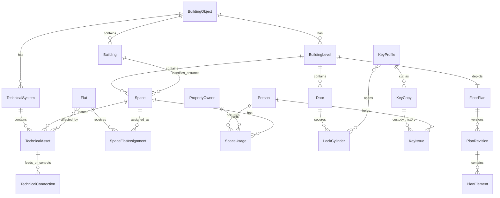

# Solomon Facilities Architecture

## Boundary

`solomon_property` remains authoritative for the legal and contact domain:

- building objects and entrances
- flats
- persons, owners, and tenants
- ownership and tenancy history

`solomon_facilities` owns the physical and operational domain:

- shared building levels and floor plans
- physical spaces and geometry
- exclusive-use and rented-space assignments
- doors, lock cylinders, key profiles, physical key copies, and custody
- gas, water, heating, electrical, low-current, ventilation, and fire-safety
  systems

This prevents a geometric polygon from being confused with a legal unit and
avoids copying personal records into a drawing payload.

## Relationship model

### Geometry

Fabric.js is an editor adapter, not the database format. `PlanElement.geometry`
uses a small canonical JSON vocabulary: `rect`, `line`, `polyline`, `polygon`,
`point`, and `text`. Styling, semantic links, and geometry are separate fields.
Published revisions are read-only in the editor. Editing creates or reuses a
draft revision, and publishing makes that revision active.

This keeps geometry portable to SVG, GeoJSON, QGIS, IFC, or another editor.

### Keys

A physical key does not link directly to doors:

1. A `LockCylinder` secures a door.
2. A `KeyProfile` opens one or more cylinders, including master-key patterns.
3. A `KeyCopy` is one tagged physical item cut to a profile.
4. A `KeyIssue` records who held that copy and when.

A database constraint allows only one unreturned issue per physical copy.
Historical issues are retained.

### Technical topology

Asset location and system connectivity are independent. A valve can move on a
plan without changing what it isolates. `TechnicalConnection` captures
directional relationships such as feeds, controls, isolates, and monitors.
Assets can explicitly list affected flats and spaces until downstream tracing
is implemented.

## Source analysis

Analyzed sources:

- `support/floor-schematics/Šalounova_1PP_4.pdf`
- `support/floor-schematics/Šalounova_1NP_přeměření.pdf`
- `support/floor-schematics/Šalounova_2NP.pdf` through `Šalounova_6NP.pdf`
- `support/Šalounova 1937-41_PV_verze_110423_POSLEDNÍ_poslané 130423.pdf`

The seven plans contain vector paths and extractable positioned text, with no
embedded raster images. Their content is rotated within portrait PDF pages, so
the imported revision records a `-90` degree background rotation and uses a
landscape `1190.52 x 841.92` canvas.

The importer retains the original PDF and generated SVG as provenance. It does
not claim that PDF linework has been reconstructed into semantic polygons.
Apartment click targets are small overlays derived from verified positioned
area labels. Users can trace and replace these with full polygons in a draft.

### Verified inventory

- Five connected entrances: 1937, 1938, 1939, 1940, and 1941.
- 85 flats total: 23 in each of 1937-1939, and 8 in each of 1940-1941.
- Shared levels: 1PP, 1NP, 2NP, 3NP, 4NP, 5NP, and 6NP.
- 52 cellar cubicles assigned to specific flats.
- 52 loggias assigned for exclusive use.
- Cellars and loggias are legally common parts under exclusive use, not part of
  apartment floor area. Declaration pages 125-128.
- Common-room inventory: 4 laundries, 8 drying rooms, 2 mangle rooms, 2
  ironing rooms, 2 pram rooms, 2 bicycle rooms, 2 moped rooms, 2 combined
  bicycle/moped rooms, 4 cleaning rooms, 5 common WCs, 1 washroom, 1
  workshop/HUV room, 2 maintenance rooms, 9 stores, and 1 club room.
  Declaration pages 125-126.

The importer enriches existing flats only. It recognizes both `1937/4` and a
suffix-only `4` within entrance 1937. Existing conflicting nonblank values are
reported and retained.

### Verified building systems

- Gas: two HUP groups, one for 1937-1939 and one for 1940-1941. Each entrance
  has two basement riser branches. Declaration page 4.
- Water: PPR distribution and a main water valve in the workshop/HUV room.
  Declaration pages 4, 125, and 126.
- Heating: district heating with vertical risers, thermostatic valves, and RTN
  allocators. Declaration pages 4-5 and 126.
- Electrical: RIS, 230/400 V distribution, and meter switchboards. Entrances
  1937-1939 have meter boards in 1PP; 1940-1941 have them in 1NP. Declaration
  pages 5, 102, 114, and 125.
- Low-current: common TV/data, telephone, and doorbell distribution.
  Declaration pages 126-127.

The legal declaration confirms system existence and topology but generally not
exact schematic coordinates. The importer creates these assets with source
notes and marks exact room/point and served-stack assignments as survey work.
It intentionally does not set per-flat `gas_installed` values.

### Scale limitation

The title blocks state 1:75, but the basement PDF page size differs from the
other drawings. Real-world dimensions must be calibrated from a surveyed known
length before measurements derived from PDF coordinates are treated as metric.

## Open-source references

These projects informed concepts only. No source code was copied.

- [openMAINT](https://www.openmaint.org/), AGPLv3: buildings, floors, rooms,
  installations, contracts, 2D geometry, GIS, and IFC. It is the closest broad
  facility-management reference.
- [CMDBuild](https://www.cmdbuild.org/), AGPLv3: typed classes, relationships,
  workflows, documents, and change history.
- [GLPI](https://github.com/glpi-project/glpi), GPLv3: hierarchical locations,
  heterogeneous assets, contracts, interventions, and plugin isolation.
- [Snipe-IT](https://github.com/grokability/snipe-it), AGPLv3: model versus
  physical asset, checkout/check-in, status, audit, and custody history. This
  informed physical key copies and issues.
- [Homebox](https://github.com/sysadminsmedia/homebox), AGPLv3: nested
  locations, labels, documents, photos, and maintenance records.
- [OSM Simple Indoor Tagging](https://wiki.openstreetmap.org/wiki/Simple_Indoor_Tagging):
  levels, rooms, corridors, walls, doors, stairs, elevators, names, and
  references.
- [OGC IndoorGML](https://www.ogc.org/standards/indoorgml/): cell-space and
  transition concepts for possible future indoor routing.
- [Brick Schema](https://github.com/BrickSchema/Brick), BSD-3-Clause:
  locations, equipment, feeds, controls, and points. This informed technical
  topology.
- [IfcOpenShell](https://github.com/IfcOpenShell/IfcOpenShell), primarily
  LGPLv3 or later: IFC spaces, containment, systems, elements, and ports for
  future interchange.
- [Fabric.js](https://github.com/fabricjs/fabric.js), MIT: replaceable browser
  vector editor with JSON/SVG support.

## Permissions and privacy

- Viewing plans requires `solomon_facilities.view_floorplan`.
- Editing requires change permission for both the plan and its revision.
- Occupant names are returned by the plan data endpoint only when the user can
  view `solomon_property.Person` or `PropertyOwner` as appropriate.
- Lock-to-key-profile details are returned only when the user can view key
  profiles.
- Keys, occupant data, and plan revisions should not share one broad role in
  production. Use separate NetBox object permissions.

## Remaining work

1. Trace full space polygons and basement common-room outlines from the vector
   sources, with review before publication.
2. Survey exact HUP, HUV, switchboard, provider board, heating-riser valve, and
   fire-safety positions.
3. Record served flats/rooms for each heating and gas branch, then derive
   affected spaces through topology.
4. Inventory cylinders, master-key profiles, and individually tagged key
   copies. No key facts were inferred from the drawings.
5. Add key issue acknowledgements, overdue reminders, and automatic copy-status
   reconciliation.
6. Add plan revision comparison and approval workflow.
7. Consider SVG/GeoJSON export first, then IFC or IndoorGML only when an actual
   interchange or routing use case requires it.